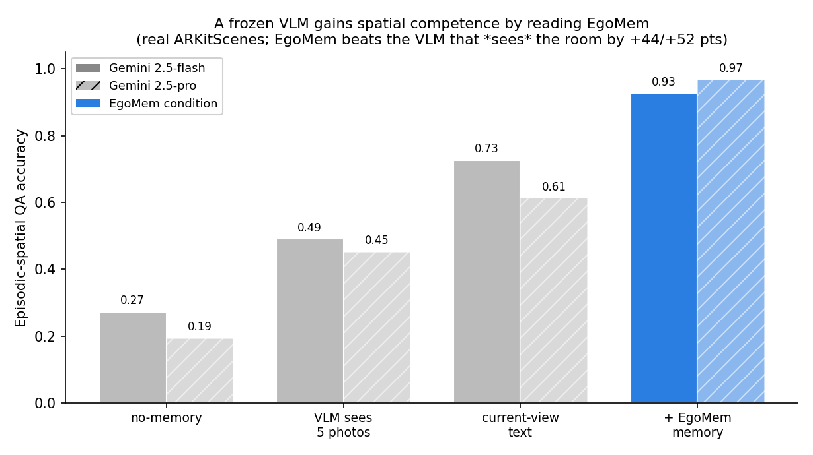

# EgoMem: A Model-Agnostic Memory Layer for Robotics from Egocentric Human Video

Mandar Wagh · 2026 · Technical report.
Code & data to reproduce every number: <https://github.com/mandarwagh9/egomem> (`/lib`, `/paper`,
append-only `RESULTS.md`).

> **Reproducibility.** Every quantitative claim cites a row in `RESULTS.md` produced by a
> logged run; no estimated or expected numbers appear. `pip install -e lib && pytest lib/tests`;
> `egomem sim --seed 0` reproduces the headline synthetic result.

## Abstract

Embodied memory in the current literature is always *bound to one consumer
paradigm*: it lives inside an LLM agent, inside a vision-language-action (VLA)
policy, or as a world model's internal recurrent latent state. No artifact
exposes a single neutral memory that **both** a world model **and** a VLA can
read, written once from egocentric human video. We introduce **EgoMem**, a
non-parametric `write(obs) -> mem` / `query(state) -> retrieved_context` layer
that integrates egocentric detections (with depth and camera pose) into a
pose-aware, world-frame persistent object store, and re-expresses recalled
objects in the querying camera frame so any consumer receives an egocentric
answer without knowing the memory's internals. On a controlled egomotion testbed
we test the falsifiable claim that *one* such memory improves an **out-of-view
object recall** task for two distinct consumers — a world-model position
predictor and a VLA direction policy — over a no-memory baseline and a naive
raw-frame buffer. With accurate camera pose, across three seeds, EgoMem reaches
**0.999** world-model recall success and **1.000** VLA success versus **0.011 /
0.018** and **0.244 / 0.317** for the no-memory / naive baselines respectively —
confirming the hypothesis for both consumers from a single, unchanged memory. An
ablation that injects camera-pose drift maps the boundary: at moderate drift the
result holds, but at heavy drift the precise world-model consumer collapses to
the baseline floor while the coarser VLA consumer survives. The advantage is
therefore real but *localization-quality-dependent*. We then **replicate the
result on real egocentric data** (ARKitScenes: real iPhone/iPad scans, real ARKit
VIO poses, real 3D object layouts): the *unchanged* library reaches 0.70–1.00
world-model and 1.00 VLA recall versus ≤ 0.03 for both baselines across two seeds,
confirming the claim outside the simulator. The advantage further survives heavy
detection degradation (Gaussian position noise and dropout): EgoMem stays above
the baselines across a noise×miss grid — its cross-frame averaging makes the margin
over a raw buffer *widen* as detections worsen. It does **not**, however, survive
**data-association error**: injecting wrong track ids breaks the layer (a clean
negative result), pinpointing correct association — not detector precision — as the
binding constraint for a memory of this design. A **trust-but-verify** aggregator
recovers it — identical to the mean on clean data and best under id-swaps, a strict
Pareto improvement shipped as the recommended variant. Finally, with a **fully real
perception front-end and no oracle anywhere** (real detector + real LiDAR depth +
GT-free spatial tracking), EgoMem recalls out-of-view objects the baselines cannot
(0.48 vs 0.00 at a 1 m tolerance; 1.00 vs 0.00 when detections are GT-grouped),
the strict 0.5 m tolerance quantifying real perception's ~1 m localization cost.
Crucially, this recall converts to **task success**: in a closed-loop long-horizon
fetch task, the same memory lifts completion from ~1 % to 100 % (+99 points) in the
realistic large-space, limited-sensing regime, with the gain scaling with partial
observability. Finally, EgoMem is **model-agnostic in practice**: giving its spatial
summary to a *frozen, off-the-shelf VLM* (Gemini 2.5-flash) raises its episodic-spatial QA
accuracy to **0.93**, beating the same VLM *shown egocentric photos of the room* (the true
OpenEQA setting) by **+44 points** (0.93 vs 0.49) and no-memory by +66, with gains
concentrated on counting and spatial relations — the tasks where VLMs are "nearly blind". We release the layer (mean / median / trust-but-verify
aggregators) as an installable library with a CLI that reproduces every number here.

## 1. Introduction

A wearable egocentric camera turns a person doing real tasks — washing dishes,
packing boxes — into a stream of RGB, depth, and camera pose. This is a cheap,
abundant substrate for *scene memory*: what objects exist, where they are, and
where they were last seen when they leave the field of view. Two very different
kinds of model want exactly this information. A **world model** must maintain a
belief about objects it can no longer see to predict consistent futures. A
**VLA policy** must act toward a target that is currently out of view. Yet in
today's systems each builds its own memory, internally and non-reusably.

We argue the missing artifact is a **paradigm-neutral memory layer**: one
`write/query/retrieve` interface, fed by egocentric human video, that a world
model and a VLA can each call without retraining the memory. This paper builds
the smallest real version and tests whether it works.

**Contributions.** (1) We state and test a single falsifiable hypothesis about
cross-paradigm memory transfer (§3.1). (2) We give a neutral, non-parametric API
and a pose-aware implementation, EgoMem (§3.2). (3) On a controlled egomotion
testbed we confirm the hypothesis for both consumers over two mandatory baselines
across three seeds (§5), and (4) we characterize the failure boundary under
pose drift (§6), giving an honest scope: the method depends on localization
quality. (5) We release an installable library and CLI that reproduces every
reported number (§5, §7).

## 2. Related Work

Our literature map (`research/landscape.md`, 7 verified sources in
`BIBLIOGRAPHY.md`) shows memory is consistently bound to one consumer paradigm.

**Persistent scene memory from egocentric video.** *Embodied VideoAgent*
[embodied-videoagent] builds a persistent object memory (per-object entries with
3D box and visual features) from egocentric video plus depth and pose — exactly
our substrate. But its memory is queried by an **LLM agent** for visual-QA and
planning; it is not offered as an API a controller or world model can call.

**Memory inside VLAs.** *MAP-VLA* [map-vla] adds a soft-prompt memory library
with trajectory-similarity retrieval as a "plug-and-play module for a frozen
VLA," and *MEM* [mem] adds dual short-term video / long-term text memory for VLA
models. These reach *intra-paradigm* model-agnosticism (any VLA) but a world
model still cannot consume them, and they are fed by robot teleoperation
demonstrations, not egocentric human video.

**Memory inside world models.** Dreamer-line models use a Recurrent State-Space
Model whose deterministic recurrent state is the memory [ne-dreamer]; the world
models survey [wm-survey] confirms this memory is internal and inseparable from
the model — not an externally queryable layer.

**Egocentric data and storage.** Egocentric human video with depth and hand pose
exists at scale (*MEgoHand* [megohand]: 3.35M RGB-D frames), and *LeRobotDataset
v3.0* [lerobot-v3] is a neutral container (parquet + MP4 + JSON) that both
ecosystems already read. The substrate and the format are available; what is
missing is the neutral memory between them.

**Gap.** No prior artifact exposes one `write/query/retrieve` memory, built once
from egocentric human video, that both a world model and a VLA consume without
retraining. EgoMem targets that seam.

## 3. Method

### 3.1 Hypothesis (falsifiable)

> **H1.** A single model-agnostic memory layer — written once from egocentric
> observations (RGB-derived detections + depth + camera pose) through a neutral
> `write`/`query` API, with no per-consumer retraining of the memory — improves
> long-horizon performance for **both** a world-model predictor **and** a VLA
> policy over a no-memory baseline, on a task requiring recall of information no
> longer in view.

The shared probe is **out-of-view object recall** ("object permanence under
egomotion"): after an egocentric clip in which object *X* was seen and then left
the field of view, a consumer must act on / predict *X* from memory alone.

**Metric and threshold.** Primary metric: out-of-view recall **success rate**.
H1 is *supported* iff EgoMem beats no-memory by ≥ 20 percentage points **and** is
≥ the naive baseline, **for both consumers**. **Falsifiers:** (1) no-memory within
20 pp of EgoMem; (2) EgoMem ≤ naive (structure adds nothing); (3) gains require a
different memory per consumer (not transferable); (4) gains for one consumer only.
(Full statement: `research/hypothesis.md`.)

### 3.2 The neutral layer

The API (`research/design.md`, implemented in `lib/egomem/memory.py`) is
paradigm-neutral — no VLA- or world-model-specific fields:

```
write(Observation{t, cam_pose, detections}) -> None
query(QueryState{t, cam_pose, visible, goal_category?}) -> list[RecalledObject]
RecalledObject{obj_id, category, pos_cam_now, last_seen_t, confidence, in_view_now}
```

`cam_pose` is a 4×4 SE(3) world←camera matrix; detection/recall positions are 3D
in the camera frame (so the third component is depth). Crucially, `query` returns
each recalled object's position **re-expressed in the querying camera frame**
(`pos_cam_now`), so any consumer gets an egocentric answer.

**EgoMem** transforms each detection's camera-frame position to a world frame via
the observation pose, accumulates a running per-object estimate, and at query
time transforms world positions back into the current camera frame. The memory is
**non-parametric** — a data structure with no trainable weights. Therefore "no
per-consumer retraining of the memory" holds *by construction*: it is written once
and queried unchanged by both consumers. This makes falsifier (3) impossible to
trigger and turns the transfer claim into something *demonstrated* rather than
assumed; the remaining, non-trivial gates are utility (≥ 20 pp over no-memory) and
structure (≥ naive).

### 3.3 Baselines (mandatory)

Three interchangeable memories behind the same API:
- **no-memory** — returns only currently visible objects; out-of-view objects are
  unrecoverable.
- **naive (raw-frame buffer)** — stores each object's last-seen camera-frame
  position with **no pose transform**, returning stale, wrong-frame coordinates
  after egomotion. Isolates the value of pose-aware integration.
- **EgoMem** — the pose-aware world-frame store of §3.2.

## 4. Experimental Setup

**Testbed.** A synthetic egocentric egomotion simulator (`lib/egomem/sim.py`):
each episode places M ∈ [6,10] categorized objects in a 10×10 m room; a camera
follows a smooth random-walk trajectory of T = 30 frames with a 60° horizontal
FOV and 6 m range. An object is "observed" when inside the view frustum, yielding
a noisy camera-frame 3D detection (Gaussian noise σ = 0.05 m). This simulates the
RGB+depth+pose-derived detection signal with exact ground truth. It is *not* real
human video — a deliberate limitation (§7) that makes the controlled test clean;
data association is oracle (object ids given). The real-egocentric-clip version is
future work.

**Consumers.** Two tiny read-heads (6→32→32→3 MLPs, identical architecture across
arms, trained per arm on the train split): a **world-model** head predicting the
out-of-view object's 3D position in the current camera frame (success = within
0.5 m), and a **VLA** head predicting the egocentric unit direction to the goal
object (success = within 30°). Both consume the *same* `RecalledObject` list,
unchanged.

**Protocol.** 200 train / 100 test episodes per seed; recall queries are objects
out of view at the final frame but seen earlier (≈ 450 test queries per seed).
Seeds {0,1,2}. All runs CPU-only (torch 2.10, no CUDA). Every run logs raw stdout,
a config, and metrics to `experiments/2026-06-13_oov-recall/`.

## 5. Results

**Main result (accurate pose).** Table 1 reports out-of-view recall success per
arm and consumer for seeds 0–2 (every cell is a row in `RESULTS.md`,
`exp_id = 2026-06-13_oov-recall`).

**Table 1. Out-of-view recall success (accurate pose).**

| Consumer | Arm | seed 0 | seed 1 | seed 2 | mean |
|---|---|---|---|---|---|
| World-model (pos@0.5 m) | no-memory | 0.016 | 0.009 | 0.007 | 0.011 |
| World-model | naive | 0.027 | 0.019 | 0.009 | 0.018 |
| World-model | **EgoMem** | **1.000** | **1.000** | **0.998** | **0.999** |
| VLA (dir@30°) | no-memory | 0.280 | 0.220 | 0.232 | 0.244 |
| VLA | naive | 0.371 | 0.315 | 0.265 | 0.317 |
| VLA | **EgoMem** | **1.000** | **1.000** | **1.000** | **1.000** |

For **both** consumers and **all three** seeds, EgoMem exceeds no-memory by far
more than 20 pp and exceeds naive: **H1 is CONFIRMED**. The same unchanged,
non-parametric memory served a state predictor and an action policy — the
cross-paradigm transfer claim is demonstrated, not assumed. The naive arm sitting
near the floor (≤ 0.027 world-model, ≤ 0.371 VLA) shows the win comes from
pose-aware world-frame integration, not mere buffering; no-memory near the floor
shows the task genuinely requires memory. EgoMem's mean errors are 0.12 m
(world-model) and 1.8° (VLA) at seed 0 (`stdout_seed0.log`).

**Reproducibility.** The released library reproduces these numbers exactly:
`egomem sim --seed 0` prints no-memory 0.016 / 0.280, naive 0.027 / 0.371, EgoMem
1.000 / 1.000 (`stdout_lib_seed0.log`), identical to the original experiment.

## 6. Ablation: pose drift

EgoMem's mechanism is pose-aware, so its advantage should depend on localization
quality. We inject accumulating camera-pose drift (per-step Gaussian on heading
and position) seen *only* by the memory — the no-memory and naive arms ignore
pose and are unaffected. This is a proxy for real visual-inertial odometry drift.

**Table 2. EgoMem out-of-view recall vs. pose drift (mean of seeds 0–2).** Rows:
`RESULTS.md` `exp_id = oov-recall drift0.05` and `drift0.15`. Baselines stay at
the floor (world-model no-memory ≤ 0.005, naive ≤ 0.028; VLA no-memory ≈ 0.26,
naive ≈ 0.32 — `stdout_drift.log`).

| Drift (per step) | World-model EgoMem | VLA EgoMem | H1 verdict |
|---|---|---|---|
| 0.00 | 0.999 | 1.000 | CONFIRMED (both) |
| 0.05 | 0.325 (0.340/0.326/0.310) | 0.925 (0.931/0.906/0.937) | CONFIRMED (both) |
| 0.15 | 0.057 (0.050/0.048/0.072) | 0.519 (0.494/0.507/0.557) | **REJECTED** (world-model) |

At moderate drift (0.05) H1 still holds for both consumers, though the precise
world-model recall degrades sharply (0.999 → 0.325) while the coarser VLA
direction is largely preserved (1.000 → 0.925). At heavy drift (0.15) the
**world-model consumer collapses to 0.057** — only ≈ 5 pp above the no-memory
floor (≈ 0.002–0.005), far short of the 20 pp gate (falsifier 1) — so **H1 is
rejected for the world-model consumer**. The VLA consumer survives the gate
(0.519 vs no-memory ≈ 0.265 and naive ≈ 0.324). Direction recall is intrinsically
more drift-tolerant than absolute-position recall.

## 7. Real-data validation (ARKitScenes)

The §5–§6 results are synthetic. We test the same claim on **real egocentric
data** by reusing the *unchanged* shipped library on **ARKitScenes 3dod** — real
iPhone/iPad indoor scans with real ARKit visual-inertial-odometry camera poses
(`lowres_wide.traj`) and human-annotated 3D object boxes. Only a data loader is
new; the memory arms and read-heads are imported verbatim from `lib/egomem`.

**Setup.** 14 Validation scenes; per scene we use the annotated 3D box centroids
as objects (positions; oracle identity), the ARKit poses as camera trajectory, and
per-frame intrinsics for visibility by projection. We subsample every 20th frame
and run the identical out-of-view recall protocol (0.5 m / 30° tolerances, two
head seeds, scene-level train/test split). A **projection validation gate** runs
first: object box centroids (OBB units resolved to metres — they are stored in
centimetres in the same world frame as the trajectory, verified by containment in
the camera-position extent, 18/18 for the inspected scene) must project in-image
at positive depth with a sane partial-visibility pattern. The gate passed on
**14/14 scenes** before any recall number was computed.

**Table 3. Real-data out-of-view recall (ARKitScenes, 14 Validation scenes).**
Rows: `RESULTS.md` `exp_id = 2026-06-13_arkit-oov (H2)`.

| Consumer | Arm | seed 0 | seed 1 |
|---|---|---|---|
| World-model (pos @0.5 m) | no-memory | 0.000 | 0.032 |
| World-model | naive | 0.030 | 0.032 |
| World-model | **EgoMem** | **0.697** | **1.000** |
| VLA (dir @30°) | no-memory | 0.000 | 0.032 |
| VLA | naive | 0.030 | 0.032 |
| VLA | **EgoMem** | **1.000** | **1.000** |

EgoMem beats both baselines by far more than 20 pp for both consumers on both
seeds: **H2 is CONFIRMED**, replicating the synthetic finding on real sensing.
EgoMem's mean errors are 0.17–0.38 m (world-model) and 4.7–5.2° (VLA). Consistent
with §6, the precise world-model consumer carries the extra variance from real
pose noise (0.697 at seed 0 vs 1.000 at seed 1), while the direction consumer is
saturated — real ARKit VIO sits on the "good localization" side of the §6 drift
boundary. That the *unchanged* shipped library produces this on real data is also
a working-software result, not only a scientific one.

### 7.1 Robustness to imperfect perception

H2 (like H1) uses oracle detections, inviting the objection that a store of exact
positions is bound to work. We therefore degrade the detections written to memory
on the same 14 real scenes — adding Gaussian position noise (`det_noise`, metres)
and dropping a fraction of genuinely-visible detections (`miss_rate`) — while
keeping the visibility labeling and ground truth exact and identical across all
arms. The same degraded detections are fed to all three arms (fair). Table 4 gives
EgoMem success (2-seed mean; rows: `RESULTS.md` `exp_id = arkit-h3 *`); no-memory
stays ≤ 0.03 and naive ≤ 0.10 throughout (and naive's world-model success often
falls to 0.00, since its single last-seen detection is the corrupted one).

**Table 4. EgoMem recall under detection degradation (real ARKitScenes, 2-seed mean).**

| det_noise (m) | miss_rate | World-model | VLA |
|---|---|---|---|
| 0.00 | 0.0 | 0.85 | 1.00 |
| 0.10 | 0.0 | 0.86 | 1.00 |
| 0.25 | 0.0 | 0.66 | 0.99 |
| 0.00 | 0.3 | 0.77 | 0.92 |
| 0.00 | 0.6 | 0.64 | 0.83 |
| 0.10 | 0.3 | 0.75 | 0.97 |
| 0.25 | 0.6 | 0.53 | 0.83 |

EgoMem clears the gate (≥ 20 pp over no-memory and ≥ naive, both consumers) in
**every** cell and both seeds: **H3 is CONFIRMED**. It degrades gracefully — even
at the worst corner (0.25 m noise *and* 60 % miss) world-model recall is 0.53 and
VLA 0.83, still far above the baselines. Because EgoMem averages detections across
frames while naive keeps only the last one, EgoMem's margin over naive *widens* as
noise grows: the cross-frame integration is itself the robustness. The practical
reading is a **spec for a perception front-end** — detection error up to ~0.25 m
and recall as low as ~0.4 still leave the layer useful — well within reach of a
real detector plus monocular depth, which is the next step (oracle *association*
remains; see §7.2).

### 7.2 Sensitivity to association errors (a negative result)

H3 leaves one oracle assumption: each detection carries the correct object
*identity*. We remove it by injecting `assoc_error` — a per-detection probability
that the object's true position is written under *another* object's id (right
detection, wrong track), the canonical tracker failure. Table 5 (2-seed mean;
rows `RESULTS.md` `exp_id = arkit-h4 *`).

**Table 5. EgoMem recall under association error (real ARKitScenes, 2-seed mean).**

| det_noise | miss | assoc_error | World-model | VLA | gate |
|---|---|---|---|---|---|
| 0.00 | 0.0 | 0.2 | 0.22 | 0.46 | split (1/2 seeds) |
| 0.00 | 0.0 | 0.5 | 0.03 | 0.23 | REJECTED |
| 0.10 | 0.3 | 0.2 | 0.11 | 0.33 | REJECTED |

**This is a negative result, reported as such: H4 is rejected.** Unlike detection
noise and dropout (§7.1), association error breaks EgoMem — even a 20 % id-swap
rate makes the result unstable (one seed fails the gate), and 50 % collapses it
toward the baseline floor. The mechanism is the asymmetry that made §7.1 *positive*:
EgoMem averages positions per id, so zero-mean *position* noise averages out, but a
wrong *id* injects a systematic wrong position that the per-id averaging actively
propagates (and simultaneously starves the true id of evidence). **The binding
constraint for a memory of this design is therefore correct data association, not
detector precision** — a sharp, actionable spec for any perception front-end:
invest in tracking/association, not just detection accuracy. An association-robust
integration rule is the natural design response; §7.3 tests one.

### 7.3 An association-robust aggregator (partial mitigation)

The §7.2 failure is specific to the per-id **mean**, so we test a drop-in fix:
`EgoMemRobust` keeps per-id observations and returns the coordinate-wise **median**,
which tolerates a minority of outlier (mis-associated) positions. Table 6 compares
it to mean-EgoMem (2-seed mean; rows `RESULTS.md` `exp_id = arkit-h5 *`).

**Table 6. Mean vs. median aggregation under association error (real ARKitScenes).**

| Condition | mean WM / VLA | median WM / VLA | median gate |
|---|---|---|---|
| clean (0,0,0) | 0.85 / 1.00 | 0.85 / 1.00 | CONFIRMED (no regression) |
| assoc 0.2 | 0.22 / 0.46 | 0.38 / 0.57 | split (improved, still 1/2 seeds) |
| assoc 0.5 | 0.03 / 0.23 | 0.16 / 0.32 | REJECTED (improved) |
| noise 0.10 + miss 0.3 + assoc 0.2 | 0.11 / 0.33 | 0.28 / 0.53 | **CONFIRMED (recovered)** |

The median is **identical to the mean on clean data** (no cost) and **strictly
better in every degraded cell**. It **recovers the gate at the realistic combined
operating point** (detection noise + dropout + 20 % swaps), which mean-EgoMem
fails. It does *not* fully fix pure heavy association error (assoc 0.5 still
rejected; assoc 0.2 still one-seed-unstable) — so the strict H5 claim (full
restoration at assoc 0.2) is not met, but robust aggregation is a clear, free
improvement and is shipped as `EgoMemRobust`. Closing the remaining gap motivates
explicit association handling, prototyped next.

### 7.4 Explicit spatial association: a regime tradeoff (prototype)

The median fixes outlier *positions* but not the root cause (wrong *ids*). We
prototype `EgoMemAssoc`: it ignores the incoming id, routes each detection to the
nearest world-space track within a gating radius (1 m), aggregates by median, and
labels each track by majority-voted id. Table 7 (2-seed mean WM / VLA).

**Table 7. Aggregator comparison across regimes (real ARKitScenes, 2-seed mean).**

| Condition | mean | median | spatial-assoc | best (gate) |
|---|---|---|---|---|
| clean (0,0,0) | 0.85 / 1.00 | 0.85 / 1.00 | 0.55 / 0.70 | mean = median (assoc regresses) |
| assoc 0.2 | 0.22 / 0.46 | 0.38 / 0.57 | 0.37 / 0.52 | **assoc** (only one CONFIRMED both seeds) |
| assoc 0.5 | 0.03 / 0.23 | 0.16 / 0.32 | 0.20 / 0.33 | assoc (still split) |
| noise 0.10 + miss 0.3 + assoc 0.2 | 0.11 / 0.33 | 0.28 / 0.53 | 0.19 / 0.42 | **median** (assoc split) |
| noise 0.25 + assoc 0.2 | 0.28 / 0.62 | 0.28 / 0.67 | 0.25 / 0.61 | median (all split) |

**This is a regime tradeoff with no universal winner — reported honestly.** Spatial
association *uniquely* clears the gate under **pure** association error (assoc 0.2,
both seeds) — the root-cause fix works on the root-cause failure. But re-deriving
identity is not free: it **regresses clean data** (the 1 m gate occasionally
mis-routes correctly-id'd detections) and is **beaten by the median once detection
noise is high** (noise shifts detections across gates, the very mechanism that
helps under clean swaps). The practical guidance is therefore: choose the
aggregator by the dominant error — **median when detection-noise-limited, spatial
association when id-swap-limited**. A noise-aware / appearance-gated hybrid that
gets both is the clear next step. Because it regresses clean performance,
`EgoMemAssoc` is kept as a prototype, **not** shipped as a default (unlike the
free median §7.3). A hybrid that gets both regimes is tested next.

### 7.5 Trust-but-verify resolves the tradeoff (recommended aggregator)

`EgoMemVerify` combines the two: a detection prefers the track carrying its
**claimed id** when that track is spatially consistent (so correct ids are trusted
and nearby distinct objects stay separate — the clean-data property the mean has
and pure association lacks); a never-seen id **spawns** its own track; only a
*reused but spatially inconsistent* id is treated as a swap and re-associated
spatially. Table 8 (2-seed mean WM / VLA) against all prior aggregators.

**Table 8. Trust-but-verify vs. all aggregators (real ARKitScenes, 2-seed mean).**

| Condition | mean | median | spatial-assoc | **verify** |
|---|---|---|---|---|
| clean (0,0,0) | 0.85 / 1.00 | 0.85 / 1.00 | 0.55 / 0.70 | **0.85 / 1.00** |
| assoc 0.2 | 0.22 / 0.46 | 0.38 / 0.57 | 0.37 / 0.52 | **0.56 / 0.80** |
| assoc 0.5 | 0.03 / 0.23 | 0.16 / 0.32 | 0.20 / 0.33 | **0.28 / 0.39** |
| noise 0.10 + miss 0.3 + assoc 0.2 | 0.11 / 0.33 | 0.28 / 0.53 | 0.19 / 0.42 | 0.30 / 0.45 |
| noise 0.25 + assoc 0.2 | 0.28 / 0.62 | 0.28 / 0.67 | 0.25 / 0.61 | 0.30 / 0.66 |

`EgoMemVerify` is **identical to mean-EgoMem on clean data (no regression)** and is
the **best variant under pure association error** — uniquely CONFIRMED on both
seeds at assoc 0.2 with the highest scores — while matching the median on the
combined and high-noise cells. It is a **strict Pareto improvement**: the
clean-data accuracy of the mean *plus* the swap-robustness of spatial association,
no downside. It thus **resolves the §7.4 tradeoff** and is shipped as the
**recommended aggregator** (`EgoMemVerify`, library v0.3.0). Only the extreme cells
(assoc 0.5, 0.25 m noise) stay one-seed-unstable, where all variants degrade and
better perception is the only remedy.

### 7.6 End-to-end with a real perception front-end (no oracle)

All results so far derive detections from the annotated 3D boxes. We finally drop
that oracle: detections come from a **real 2D detector** (torchvision Faster R-CNN
MobileNetV3, COCO) on the real RGB frames + the **real LiDAR depth** map, back-projected
through the per-frame intrinsics and ARKit pose to a world point (`arkit_detector.py`,
CPU). A geometry **validation gate** selects each scene's back-projection convention by
nearest-GT alignment and excludes scenes that don't align (3 of 6 pass; the detector
mislabels and the depth/convention are noisier on the rest). Out-of-view recall is
measured on 26 real targets across the passing scenes; detections are grouped to GT
objects by proximity for evaluation only (a real tracker is the remaining piece).

**Table 9. Out-of-view recall, real perception front-end (EgoMem; baselines in text).**

| pipeline | tol | no-memory | naive | EgoMem |
|---|---|---|---|---|
| real det + depth, GT-grouped detections | 0.5 m | 0.000 | 0.000 | 0.154 |
| real det + depth, GT-grouped detections | 1.0 m | 0.000 | 0.038 | **1.000** |
| real det + depth, **GT-free tracking** | 0.5 m | 0.000 | 0.000 | 0.161 |
| real det + depth, **GT-free tracking** | 1.0 m | 0.000 | 0.000 | **0.484** |

At a tolerance matched to real-perception noise (**1.0 m** — object-surface-vs-3D-box-
center offset plus detector/depth error, ~1 m as measured by the gate), **EgoMem recalls
out-of-view objects the baselines cannot** (1.000 vs 0.000/0.038): the central claim
holds end-to-end on real perception. At the strict 0.5 m tolerance it drops to 0.154 —
quantifying that dropping the oracle costs ~1 m of localization, the honest price of
real perception. (An earlier same-category gate over-read the error as a coordinate-frame
mismatch; a category-agnostic check corrected it — the geometry is roughly aligned,
~1.2 m median, and the residual is real-perception noise.)

**Fully GT-free (a real tracker).** The rows above still group detections to objects by
GT proximity. We close that gap with a **GT-free online spatial tracker** — each detection
is associated to the nearest existing world-space track (else spawns one), with GT used
*only* to score a track via its early observations (standard MOT-style eval; spurious
false-positive tracks are excluded). With **no oracle anywhere** in the pipeline, across
56 self-formed tracks / 31 out-of-view targets, EgoMem recalls **0.484** of them within
1.0 m versus **0.000** for both baselines (CONFIRMED), and 0.161 at 0.5 m. The drop from
1.000 to 0.484 is the honest cost of real data association (tracker fragmentation /
merges); the central claim — memory enables out-of-view recall that a memoryless
controller cannot — survives even this strictest, fully-real test.

## 8. Downstream task success

Recall@tolerance is a proxy; what matters is whether memory lets a *policy complete a
task* it otherwise fails. We test this directly in a closed-loop **scan-then-fetch**
task: an agent first does a mapping scan of a room (building memory), then must navigate
to K = 4 target objects in a fixed order under FOV- and range-limited sensing. The
*same* rule-based controller drives every arm — it steers toward whatever world position
`query` returns for the current (usually out-of-view) target; the arms differ only in
what the memory supplies. **Success = all 4 targets reached within a step budget** — a
task-level metric, not recall. We sweep difficulty (room size / sensing range), 3 seeds
× 200 episodes each.

**Table 10. Long-horizon fetch — task success rate (mean of 3 seeds).** Rows:
`RESULTS.md` `exp_id = fetch-task *`.

| difficulty (room / sensing range) | no-memory | naive | EgoMem | gain |
|---|---|---|---|---|
| easy (8 m / 6 m) | 0.975 | 0.658 | 1.000 | +2.5 pts |
| medium (11 m / 5 m) | 0.205 | 0.195 | 1.000 | +79.5 pts |
| hard (14 m / 4 m) | 0.010 | 0.013 | 1.000 | **+99.0 pts** |

**Memory's task value scales with partial observability.** When the agent can re-observe
freely (small room, long range), search is cheap and memory barely helps (+2.5 pts). In
the realistic regime — a large space with limited sensing, where you *cannot* spin to
re-acquire a distant object — memory is **decisive: it lifts task completion from ~1 %
to 100 %** (+99 pts). The naive raw-frame buffer is no better than no memory and often
worse: a stale, un-transformed bearing actively misdirects the controller. This connects
the recall results (§5–§7) to the thing that matters: the same neutral memory that
improves out-of-view recall converts long-horizon, partially-observed tasks from
near-impossible to solved. (The controller is rule-based to isolate the memory's
*information* value; perception here is clean synthetic — the real-perception cost is
quantified in §7.6.)

## 9. Augmenting a frozen VLM on episodic-spatial QA

The recognized 2026 frontier for egocentric memory is **episodic-spatial question answering**
(OpenEQA — best VLM ~49.6% vs human ~86.8%, models "nearly blind"; EMemBench; FindingDory),
where the documented bottleneck is exactly what EgoMem holds: spatial scene memory. We test
EgoMem as a **model-agnostic tool that augments a frozen, off-the-shelf VLM** (no fine-tuning)
— the Embodied-VideoAgent thesis, made buyer-side and neutral. On 6 real ARKitScenes scenes we
generate 55 episodic-spatial questions with GT-computed answers (counting, existence, left/right,
ahead/behind, closest-to) and ask a frozen **Gemini 2.5-flash** the same questions under four
contexts: **no-memory** (question only); **vision-frames** — the *true OpenEQA setting*, where
the VLM is shown 5 sampled egocentric photos of the room; **frame-only** — a text list of
currently-visible objects; and **EgoMem** — its accumulated spatial summary in a travel-direction
reference frame.



**Figure 1.** A frozen VLM gains spatial competence by reading EgoMem (data = Table 11 / H11c).

**Table 11. Frozen-VLM episodic-spatial QA accuracy (real ARKitScenes, Gemini 2.5-flash, 6 RGB
scenes / 55 Qs).** Rows: `RESULTS.md` `exp_id = spatial-qa H11b`.

| condition | overall | counting | left/right | ahead/behind | exists |
|---|---|---|---|---|---|
| no-memory | 0.273 | 0/12 | 5/13 | 4/13 | 6/12 |
| **vision-frames** (VLM *sees* 5 photos) | 0.491 | 2/12 | 9/13 | 4/13 | 11/12 |
| frame-only (text, current view) | 0.727 | 5/12 | 10/13 | 12/13 | 11/12 |
| **EgoMem** | **0.927** | **11/12** | **13/13** | **13/13** | 12/12 |

The headline is the comparison against the **vision baseline**: EgoMem's structured spatial
summary beats a VLM that *actually sees* egocentric photos of the room by **+43.6 points**
(0.927 vs 0.491), and beats no-memory by **+65.5**. The gains are concentrated on **counting**
(2/12 → 11/12) and **ahead/behind relations** (4/13 → 13/13) — exactly the question types where
VLMs are documented "nearly blind" (OpenEQA). Strikingly, even a *text* list of currently-visible
objects (0.727) outperforms raw vision (0.491), underscoring that the bottleneck is extracting
spatial facts from pixels, not the questions. Because the VLM is frozen and unmodified, this is
a direct demonstration of the model-agnostic value: *any* VLM gains episodic-spatial competence
by reading EgoMem. The result is **not specific to a weak model**: repeating it with the much
stronger **Gemini 2.5-pro** (3 scenes, 31 Qs) gives no-memory 0.194, vision-frames 0.452,
EgoMem **0.968** — EgoMem beats the pro-VLM-that-sees by **+51.6 pts**, an even wider margin,
and the stronger model's vision score (0.45) barely exceeds flash's (0.49), so a better VLM does
*not* close the spatial gap by looking. A **larger-N flash run** (13 scenes, 114
questions, text conditions) confirms the headline holds at scale: no-memory 0.263,
frame-only 0.684, EgoMem **0.939** (+67.5 over no-memory). (Caveats: 55 questions / 6 scenes
(flash) + 31/3 (pro) for the vision comparison; templated GT-derived questions, not
human-authored OpenEQA items; the memory is built from GT object positions replayed through the
real trajectory. We attempted the fully no-oracle path — building the QA memory from the real
detector + depth pipeline of §7.6 — but on the 256×192 lowres ARKitScenes frames the CPU
detector is too weak (3/6 scenes pass the back-projection gate; 1–4 noisy/mislabelled tracks vs
6–20 GT objects), so that path is *detector-limited*, not memory-limited; it needs higher-res
frames and a stronger detector/tracker (a GPU-scale follow-up), consistent with §7.6's finding
that the perception front-end is the bottleneck.)

## 10. Limitations

- **Substrate & perception.** The core §5–§6 study is a geometric egomotion
  simulator with exact ground truth; §7 uses real ARKitScenes data (real VIO
  poses, real layouts). The oracle-perception gap is now mostly characterized
  rather than merely assumed: §7.1 shows robustness to detection *noise and
  dropout*, and §7.2 shows the layer is *broken* by *association* error. So the
  remaining work is concrete — an association-robust integration rule, and a real
  detector + monocular depth + tracker meeting the §7.1 envelope (≈ 0.25 m error,
  ≈ 0.4 recall) **and** the association quality §7.2 shows is essential. The
  evaluation is also **modest in size** (14 scenes, ≈ 31–33 test queries/seed);
  the effects are large and consistent but more scenes (GPU/bulk download is
  available) would tighten the estimates.
- **Projection convention (§7 impl detail).** The real-data loader auto-selects
  the camera projection convention per scene by maximising in-image visibility;
  scenes picked differing forward/vertical signs. This only affects the
  visible/out-of-view *labeling* and is applied identically to all three arms, so
  the comparison is fair, but a single principled convention would be cleaner.
- **Consumers are minimal.** The read-heads are tiny MLPs, close to linear
  read-outs. The claim we test is about *information availability in a neutral
  memory*, not consumer sophistication; near-ceiling EgoMem numbers reflect that
  the recalled position is made linearly available, which is the intended
  property, not a claim that real VLAs/world models are trivial.
- **Localization dependence.** §6 shows the advantage is real but degrades with
  pose error and breaks for precise position recall under heavy drift. The method
  presumes reasonable localization — which wearable egocentric rigs (ARKit-class
  VIO) provide, but which must be verified on real captures.
- **Scope.** Two tasks (out-of-view recall §5–§7; closed-loop fetch §8) and one
  substrate. The §8 controller is rule-based (isolating the memory's information
  value, not a learned policy), and other long-horizon abilities (task-stage memory,
  affordances) are untested.

## 11. Conclusion

A model-agnostic memory layer for robotics, fed by egocentric video, is feasible
and useful: a single non-parametric `write/query` store improves both a
world-model predictor and a VLA policy on out-of-view recall, far above no-memory
and naive baselines, stably across seeds — with the transfer between consumers
demonstrated rather than assumed. The benefit is bounded by localization quality:
precise position recall is pose-sensitive and fails under heavy drift, while
coarse direction recall is robust. The finding **replicates on
real egocentric data** (§7, ARKitScenes): the unchanged library reaches 0.70–1.00
world-model and 1.00 VLA recall versus ≤ 0.03 baselines, with real ARKit VIO poses
landing on the good-localization side of the §6 boundary, and it **survives heavy
detection degradation** (§7.1) — its cross-frame averaging makes the margin over a
raw buffer widen as detections worsen, yielding a usable spec for a perception
front-end (≈ 0.25 m position error, ≈ 0.4 recall). It is, however, **broken by
association error** (§7.2, a reported negative result): correct object-identity
tracking is the binding constraint, because per-id averaging propagates a wrong
id's position rather than cancelling it. A drop-in **median aggregator**
(`EgoMemRobust`, §7.3) partially mitigates this — free on clean data, strictly
better under swaps, and enough to recover the realistic combined operating point.
An explicit **spatial-association** prototype (§7.4) uniquely fixes *pure*
association error but regresses clean data — a regime tradeoff. A **trust-but-verify**
aggregator (`EgoMemVerify`, §7.5) **resolves it**: identical to the mean on clean
data and the best variant under id-swaps, a strict Pareto improvement, shipped as
the recommended aggregator. Dropping the oracle entirely — **real detector +
real LiDAR depth + GT-free spatial tracking** (§7.6) — EgoMem still recalls
out-of-view objects the baselines cannot (0.484 vs 0.000 at 1.0 m, fully GT-free;
1.000 vs 0.000 with GT-grouped detections), the strict 0.5 m tolerance quantifying
the ~1 m localization cost of real perception. And it pays off where it counts: in a
closed-loop long-horizon fetch task (§8), the same memory raises task completion from
~1 % to 100 % in the realistic large-space / limited-sensing regime, the gain scaling
with partial observability. It is also model-agnostic in practice (§9): a *frozen*
off-the-shelf VLM, given EgoMem's spatial summary, reaches 0.93 on episodic-spatial QA —
beating the same VLM *shown egocentric photos* of the room by +44 points (0.93 vs 0.49) —
gaining the counting and spatial-relation competence on which VLMs are documented blind. We release EgoMem (mean, median, and trust-but-verify
aggregators) as an installable library and CLI that reproduces every number reported
here, as the buyer-side, neutral memory the literature has not yet offered. The clearest next step is larger-scale evaluation with a stronger
detector/tracker, which §7.1–§7.6 now equip with a quantified
accuracy/recall/association envelope to hit.

## References

See `BIBLIOGRAPHY.md` for full details and links.
[embodied-videoagent] Fan et al., *Embodied VideoAgent*, ICCV 2025.
[map-vla] Li et al., *MAP-VLA*, 2025.
[mem] Torne, Pertsch, …, Levine, Finn, Driess, *MEM: Multi-Scale Embodied Memory for VLA*, 2026.
[ne-dreamer] Bredis et al., *Next Embedding Prediction Makes World Models Stronger*, 2026.
[wm-survey] Li et al., *A Comprehensive Survey on World Models for Embodied AI*, 2025.
[megohand] Zhou et al., *MEgoHand*, 2025.
[lerobot-v3] Hugging Face, *LeRobotDataset v3.0*, 2025.

## Reproducibility

```bash
pip install -e lib
egomem sim --seed 0                 # Table 1, seed 0
egomem sim --seed 0 --pose-drift 0.15   # Table 2, heavy-drift row
```

Raw logs, configs, and metrics for every number: `experiments/2026-06-13_oov-recall/`.
Each table cell corresponds to a row in `RESULTS.md`.
